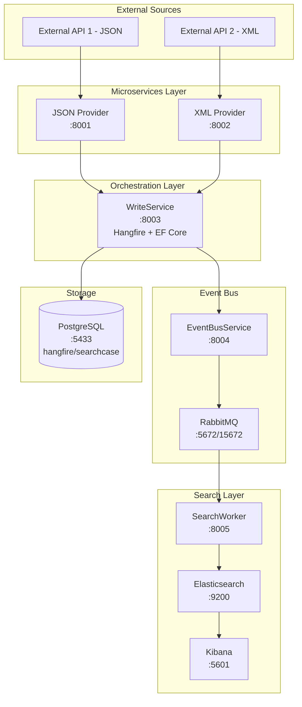

# SearchCase - Microservices Content Aggregation System

A production-ready microservices-based content aggregation platform that fetches data from multiple external providers, transforms it into a canonical format, performs change detection, and orchestrates operations using Hangfire background jobs with event-driven architecture.

## 🏗️ Architecture Overview



## 🚀 Quick Start

### Prerequisites
- Docker & Docker Compose
- .NET 8.0/9.0 SDK (for local development)
- 8GB RAM minimum
- 10GB free disk space

### Start All Services

```bash
# Clone repository
git clone <repository-url>
cd SearchCase

# Start all services with Docker Compose
docker-compose up -d

# Verify all services are running
docker ps

# View logs
docker-compose logs -f
```

### Access Points

| Service | URL | Description |
|---------|-----|-------------|
| **Hangfire Dashboard** | http://localhost:8003/hangfire | Background job monitoring |
| **RabbitMQ Management** | http://localhost:15672 | Message queue dashboard (guest/guest) |
| **Kibana** | http://localhost:5601 | Elasticsearch visualization |
| **JSON Provider Swagger** | http://localhost:8001/swagger | JSON Provider API docs |
| **XML Provider Swagger** | http://localhost:8002/swagger | XML Provider API docs |
| **pgAdmin** | http://localhost:5050 | Database management (admin@searchcase.local/admin123) |

## 🔧 Services Description

### 1. **Provider Microservices** (Ports 8001-8002)
- **JsonProviderMicroservice** (.NET 9.0): Fetches and transforms JSON data
- **XmlProviderMicroservice** (.NET 9.0): Fetches and transforms XML data
- Implements canonical transformation pattern
- Built-in retry policies and circuit breakers (Polly)
- Health checks and Swagger documentation

### 2. **WriteService** (Port 8003) - Primary Orchestrator
- Combines Hangfire scheduling with Entity Framework Core
- **ContentSyncJob**: Runs every 5 minutes
  - Fetches from all providers in parallel
  - Hash-based change detection
  - Bulk upsert operations
  - Publishes events to EventBus
- **FreshnessScoreUpdateJob**: Daily score recalculation
- Audit logging with ContentChangeLogs table
- Dashboard at http://localhost:8003/hangfire

### 3. **EventBusService** (Port 8004)
- REST API wrapper for RabbitMQ
- Publishes content change events
- Circuit breaker pattern for resilience
- Endpoints:
  - `POST /api/events/content-changed`
  - `GET /health`

### 4. **SearchWorker** (Port 8005)
- Consumes RabbitMQ messages
- Indexes content to Elasticsearch
- Bulk indexing for performance
- Automatic index management

### 5. **Infrastructure Services**
- **PostgreSQL** (Port 5433): Stores content and Hangfire jobs
- **RabbitMQ** (Ports 5672/15672): Message broker
- **Elasticsearch** (Port 9200): Full-text search engine
- **Kibana** (Port 5601): Search visualization

## 📊 Data Flow

```
1. Hangfire triggers ContentSyncJob every 5 minutes
2. WriteService calls both Provider microservices in parallel
3. Providers fetch from external APIs and transform to canonical format
4. WriteService performs change detection (NEW/UPDATED/UNCHANGED)
5. Changed content is saved to PostgreSQL
6. Events are published to EventBus → RabbitMQ
7. SearchWorker consumes messages and indexes to Elasticsearch
8. Users can search via Kibana
```

## 🗄️ Database Schema

### PostgreSQL Databases

#### `hangfire` Database
- Hangfire job storage (auto-created tables)
- Schema: `hangfire.*`

#### `searchcase` Database
```sql
-- Main content table
CREATE TABLE contents (
    id VARCHAR(255) PRIMARY KEY,
    type VARCHAR(50),
    title TEXT,
    published_at TIMESTAMP,
    categories TEXT[],
    source_provider VARCHAR(100),
    metrics JSONB,
    score DECIMAL,
    content_hash VARCHAR(64),
    created_at TIMESTAMP,
    updated_at TIMESTAMP
);

-- Audit log table
CREATE TABLE content_change_logs (
    id UUID PRIMARY KEY,
    content_id VARCHAR(255),
    change_type VARCHAR(50),
    changed_fields JSONB,
    sync_batch_id UUID,
    created_at TIMESTAMP
);

-- Sync tracking table
CREATE TABLE sync_batches (
    id UUID PRIMARY KEY,
    started_at TIMESTAMP,
    completed_at TIMESTAMP,
    status VARCHAR(50),
    items_fetched INTEGER,
    items_created INTEGER,
    items_updated INTEGER,
    items_unchanged INTEGER
);
```

## 🔑 Key Features

### Canonical Schema Pattern
- **CanonicalContent**: Base class for all content
- **CanonicalVideoContent**: Video-specific metrics (views, likes, duration)
- **CanonicalArticleContent**: Article-specific metrics (reading time, reactions)
- JSON polymorphism with type discrimination

### Change Detection Strategy
- Hash-based comparison (SHA256)
- Tracks NEW, UPDATED, and UNCHANGED items
- Optimized to only update changed content
- Complete audit trail in ContentChangeLogs

### Resilience Patterns
- **Retry Policy**: Exponential backoff with jitter
- **Circuit Breaker**: Prevents cascade failures
- **Health Checks**: Readiness and liveness probes
- **Graceful Degradation**: Partial provider failures handled

### Event-Driven Architecture
- Asynchronous processing via RabbitMQ
- Decoupled services communication
- At-least-once delivery guarantee
- Dead letter queue for failed messages

## 🛠️ Development

### Local Development Setup

```bash
# 1. Start infrastructure only
docker-compose up -d search-db rabbitmq elasticsearch

# 2. Run microservices locally
cd src/JsonProviderMicroservice && dotnet run
cd src/XmlProviderMicroservice && dotnet run
cd src/WriteService && dotnet run

# 3. Access Hangfire Dashboard
open http://localhost:8003/hangfire
```

### Building the Solution

```bash
# Build all projects
dotnet build SearchCase.sln

# Run tests
dotnet test SearchCase.sln

# Clean build artifacts
dotnet clean SearchCase.sln
```

### Adding a New Provider

1. Create new project referencing `SearchCase.Contracts`
2. Implement `IContentMapper<TProviderDto>` interface
3. Add HTTP client configuration in `ServiceCollectionExtensions`
4. Register in WriteService's `ProviderClient`

## 📝 Configuration

### Environment Variables

```env
# PostgreSQL
POSTGRES_PASSWORD=postgres

# RabbitMQ
RABBITMQ_DEFAULT_USER=guest
RABBITMQ_DEFAULT_PASS=guest

# Elasticsearch
ELASTIC_PASSWORD=elastic

# Provider URLs (for WriteService)
Providers__JsonProvider__BaseUrl=http://json-provider:8080
Providers__XmlProvider__BaseUrl=http://xml-provider:8080

# Hangfire
Hangfire__WorkerCount=2
Hangfire__SyncJobCronExpression=*/5 * * * *
```

### Connection Strings

```json
{
  "ConnectionStrings": {
    "WriteServiceDb": "Host=search-db;Port=5432;Database=searchcase;Username=postgres;Password=postgres",
    "HangfireDb": "Host=search-db;Port=5432;Database=hangfire;Username=postgres;Password=postgres"
  }
}
```

## 🔍 Monitoring & Debugging

### View Logs

```bash
# All services
docker-compose logs -f

# Specific service
docker-compose logs -f write-service
docker-compose logs -f json-provider
```

### Database Queries

```bash
# Connect to PostgreSQL
docker exec -it search-db psql -U postgres -d searchcase

# Common queries
SELECT COUNT(*) FROM contents;
SELECT * FROM content_change_logs ORDER BY created_at DESC LIMIT 10;
SELECT * FROM sync_batches ORDER BY started_at DESC LIMIT 5;
```

### Elasticsearch Queries

```bash
# Check indices
curl http://localhost:9200/_cat/indices?v

# Search content
curl http://localhost:9200/content-index/_search?q=*
```

### RabbitMQ Management

```bash
# List queues
curl -u guest:guest http://localhost:15672/api/queues

# Check messages
open http://localhost:15672
```

## ⚡ Performance Optimizations

- **Bulk Operations**: Content upserted in batches
- **Parallel Processing**: Providers called simultaneously
- **Change Detection**: Only modified content is processed
- **Score Calculation**: Computed only for changed items
- **Connection Pooling**: Optimized database connections
- **Circuit Breaker**: Prevents cascade failures

## 🔒 Security Considerations

### Development Setup
- Default passwords used (change in production!)
- No authentication on dashboards
- All services exposed on localhost

### Production Recommendations
- Use secrets management (Azure Key Vault, AWS Secrets Manager)
- Enable TLS/SSL for all communications
- Implement API authentication (JWT, OAuth2)
- Use network policies in Kubernetes
- Enable audit logging
- Regular security updates

## 🧪 Testing

### Unit Tests
```bash
dotnet test src/SearchCase.Contracts.Tests
```

### Integration Tests
```bash
# Start test environment
docker-compose -f docker-compose.test.yml up -d

# Run integration tests
dotnet test src/WriteService.IntegrationTests
```

### Manual Testing

1. **Trigger Sync Manually**:
   - Go to http://localhost:8003/hangfire
   - Navigate to "Recurring Jobs"
   - Click "Trigger Now" on ContentSyncJob

2. **Verify in Elasticsearch**:
   ```bash
   curl http://localhost:9200/content-index/_count
   ```

3. **Check Audit Logs**:
   ```sql
   SELECT * FROM content_change_logs ORDER BY created_at DESC;
   ```

## 📚 Technology Stack

- **.NET 8.0/9.0**: Microservices framework
- **Hangfire**: Background job processing
- **Entity Framework Core**: ORM for data access
- **PostgreSQL 16**: Primary database
- **RabbitMQ 3.13**: Message broker
- **Elasticsearch 8.x**: Search engine
- **Docker & Docker Compose**: Containerization
- **Polly**: Resilience and transient fault handling
- **Serilog**: Structured logging
- **FluentValidation**: Input validation
- **Swagger/OpenAPI**: API documentation

## 🤝 Contributing

1. Fork the repository
2. Create a feature branch
3. Make your changes
4. Run tests
5. Submit a pull request

## 📄 License

This project is proprietary to SearchCase.

## 📞 Support

For issues and questions:
- Check the [CLAUDE.md](./CLAUDE.md) file for detailed technical guidance
- Review logs in `/logs` directory
- Check service health endpoints

---

**Last Updated**: October 2024
**Version**: 2.0.0
**Maintainer**: SearchCase Team